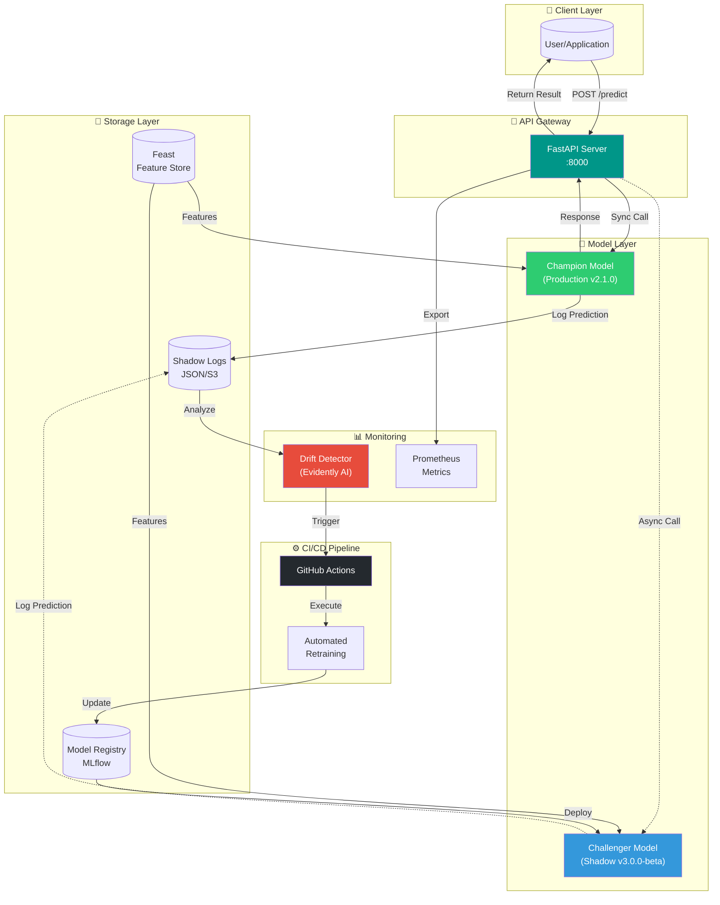
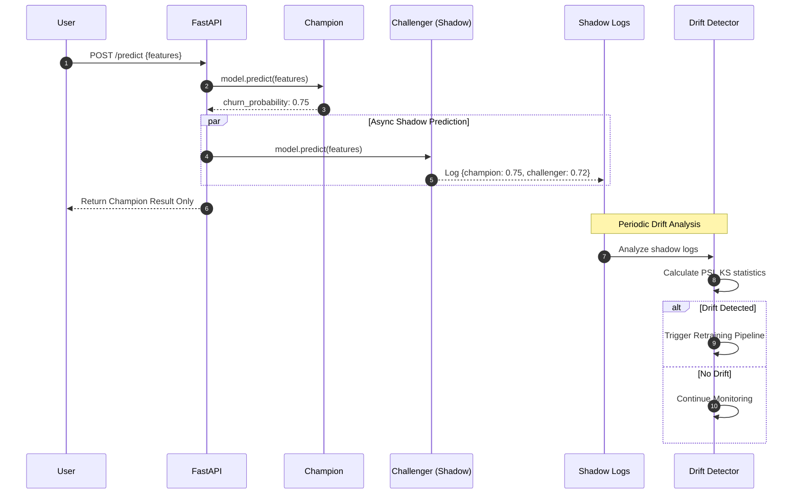
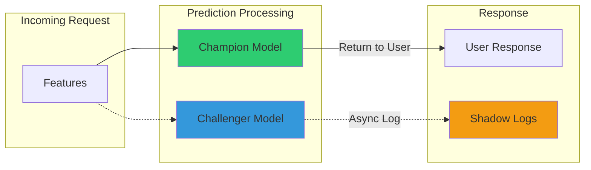
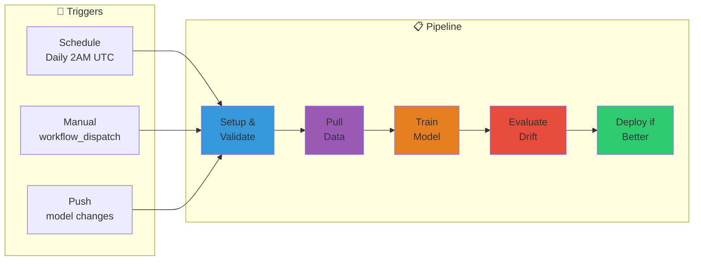

# 🚀 Shadow-MLOps: Zero-Downtime Retraining Pipeline

[](https://github.com)
[](https://feast.dev)
[](https://python.org)
[](https://fastapi.tiangolo.com)
[](LICENSE)
[](https://ml-ops.org)

> **Enterprise-grade shadow deployment platform for machine learning models with automated drift detection and zero-downtime retraining.**

---

## 📋 Table of Contents

- [Overview](#-overview)
- [Architecture](#-architecture)
- [Features](#-features)
- [Quick Start](#-quick-start)
- [Project Structure](#-project-structure)
- [API Documentation](#-api-documentation)
- [Shadow Deployment Pattern](#-shadow-deployment-pattern)
- [Drift Detection](#-drift-detection)
- [CI/CD Pipeline](#-cicd-pipeline)
- [Feature Store](#-feature-store)
- [Monitoring & Observability](#-monitoring--observability)
- [Configuration](#-configuration)
- [Contributing](#-contributing)
- [License](#-license)

---

## 🎯 Overview

**Shadow-MLOps** implements a production-grade shadow deployment pattern for churn prediction models. This platform enables:

- **Zero-downtime model updates** - Test new models in production without affecting users
- **Automated drift detection** - Monitor data and concept drift with Evidently AI patterns
- **Feature store integration** - Feast-powered feature management for consistent training/serving
- **Comprehensive CI/CD** - GitHub Actions pipeline for automated retraining and deployment

### 🎬 Use Case: Churn Prediction System

A telecommunications company needs to predict customer churn. The system:
1. Serves predictions via a **Champion** (production) model
2. Simultaneously tests a **Challenger** (shadow) model
3. Logs comparison data for analysis
4. Automatically retrains when drift is detected
5. Promotes the Challenger when it outperforms the Champion

---

## 🏗 Architecture



### Data Flow Diagram



---

## ✨ Features

### 🎭 Shadow Deployment
- **Parallel Execution**: Champion and Challenger models run simultaneously
- **Zero User Impact**: Only Champion results reach users
- **Comprehensive Logging**: Full prediction comparison stored for analysis

### 📈 Drift Detection
- **Statistical Tests**: KS-test, PSI, Chi-square for distribution comparison
- **Feature-level Analysis**: Identify which features are drifting
- **Configurable Thresholds**: Customize sensitivity per use case

### 🗄️ Feature Store (Feast)
- **Consistent Features**: Same features for training and serving
- **Point-in-time Correctness**: Prevent data leakage
- **Real-time Serving**: Low-latency feature retrieval

### 🔄 CI/CD Pipeline
- **Scheduled Retraining**: Daily drift checks and model updates
- **Manual Triggers**: On-demand retraining with configurable parameters
- **Automated Promotion**: Deploy better models without downtime

### 📊 Observability
- **Prometheus Metrics**: Model performance and latency tracking
- **Structured Logging**: JSON logs for easy parsing
- **Health Checks**: Kubernetes-ready health endpoints

---

## 🚀 Quick Start

### Prerequisites

- Python 3.10+
- Docker (optional)
- Git

### Installation

```bash
# Clone the repository
git clone https://github.com/yash-kalathiya/Edge-Native-VLM-Sentinel.git
cd Edge-Native-VLM-Sentinel

# Create virtual environment
python -m venv venv
source venv/bin/activate  # Linux/Mac
# or: venv\Scripts\activate  # Windows

# Install dependencies
pip install -r requirements.txt

# Initialize Feast feature store
cd feature_repo
feast apply
cd ..

# Run the API
uvicorn src.api:app --reload --host 0.0.0.0 --port 8000
```

### Docker Deployment

```bash
# Build the image
docker build -t shadow-mlops:latest .

# Run the container
docker run -p 8000:8000 -v $(pwd)/logs:/app/logs shadow-mlops:latest
```

### Test the API

```bash
# Health check
curl http://localhost:8000/health

# Make a prediction
curl -X POST http://localhost:8000/predict \
  -H "Content-Type: application/json" \
  -d '{
    "customer_id": "CUST_001",
    "days_since_last_login": 15,
    "login_frequency_30d": 5.0,
    "session_duration_avg": 12.5,
    "total_transactions_90d": 3,
    "transaction_value_avg": 150.0,
    "support_tickets_30d": 2,
    "subscription_tenure_days": 365,
    "satisfaction_score": 6.5
  }'

# View shadow comparison
curl http://localhost:8000/shadow/comparison
```

---

## 📁 Project Structure

```
shadow-mlops/
├── .github/
│   └── workflows/
│       └── retrain.yml          # CI/CD pipeline for retraining
├── data/
│   ├── registry.db              # Feast registry
│   └── online_store.db          # Feast online store
├── feature_repo/
│   ├── feature_store.yaml       # Feast configuration
│   └── definitions.py           # Feature definitions
├── logs/
│   ├── api.log                  # API request logs
│   └── shadow_logs.json         # Shadow prediction logs
├── models/
│   ├── champion_current.pkl     # Current production model
│   └── challenger_*.pkl         # Challenger model versions
├── monitoring/
│   ├── __init__.py
│   ├── detect_drift.py          # Drift detection module
│   └── reports/                 # Drift analysis reports
├── scripts/
│   ├── pull_training_data.py    # Data extraction script
│   └── train_model.py           # Model training script
├── src/
│   ├── __init__.py
│   ├── api.py                   # FastAPI application
│   └── models.py                # Champion/Challenger models
├── tests/
│   ├── test_api.py              # API tests
│   ├── test_drift.py            # Drift detection tests
│   └── test_models.py           # Model tests
├── .env.example                 # Environment variables template
├── Dockerfile                   # Container definition
├── docker-compose.yml           # Multi-service deployment
├── pyproject.toml               # Project metadata
├── requirements.txt             # Python dependencies
└── README.md                    # This file
```

---

## 📖 API Documentation

### Endpoints

| Method | Endpoint | Description |
|--------|----------|-------------|
| `GET` | `/health` | Health check for load balancers |
| `POST` | `/predict` | Single customer churn prediction |
| `POST` | `/predict/batch` | Batch predictions (up to 100) |
| `GET` | `/metrics` | Prometheus-compatible metrics |
| `GET` | `/shadow/logs` | Retrieve shadow prediction logs |
| `GET` | `/shadow/comparison` | Model comparison statistics |

### Request/Response Examples

#### POST /predict

**Request:**
```json
{
  "customer_id": "CUST_12345",
  "days_since_last_login": 7,
  "login_frequency_30d": 12.5,
  "session_duration_avg": 25.0,
  "total_transactions_90d": 8,
  "transaction_value_avg": 250.0,
  "support_tickets_30d": 1,
  "subscription_tenure_days": 730,
  "satisfaction_score": 8.0
}
```

**Response:**
```json
{
  "request_id": "550e8400-e29b-41d4-a716-446655440000",
  "customer_id": "CUST_12345",
  "churn_probability": 0.23,
  "churn_prediction": false,
  "risk_category": "low",
  "model_version": "v2.1.0",
  "timestamp": "2024-01-15T10:30:00Z"
}
```

### Interactive Documentation

Access the auto-generated docs at:
- **Swagger UI**: http://localhost:8000/docs
- **ReDoc**: http://localhost:8000/redoc

---

## 🎭 Shadow Deployment Pattern

### How It Works



### Shadow Log Structure

```json
{
  "request_id": "uuid",
  "customer_id": "CUST_001",
  "timestamp": "2024-01-15T10:30:00Z",
  "champion": {
    "prediction": {"churn_probability": 0.75, "churn_prediction": true},
    "latency_ms": 12.5,
    "model_version": "2.1.0"
  },
  "challenger": {
    "prediction": {"churn_probability": 0.72, "churn_prediction": true},
    "latency_ms": 15.2,
    "model_version": "3.0.0-beta"
  },
  "comparison": {
    "probability_diff": 0.03,
    "prediction_match": true
  }
}
```

---

## 📊 Drift Detection

### Detection Methods

| Method | Use Case | Threshold |
|--------|----------|-----------|
| **PSI** (Population Stability Index) | Overall distribution shift | > 0.25 |
| **KS Test** (Kolmogorov-Smirnov) | Continuous feature drift | p < 0.05 |
| **Chi-Square** | Categorical feature drift | p < 0.05 |

### Running Drift Detection

```bash
# Standard drift check
python monitoring/detect_drift.py --threshold 0.3

# Simulate drift scenario
python monitoring/detect_drift.py --simulate-drift 0.5

# Generate detailed report
python monitoring/detect_drift.py --output reports/drift_$(date +%Y%m%d).json
```

### Exit Codes

| Code | Meaning | CI/CD Action |
|------|---------|--------------|
| `0` | No drift detected | Continue monitoring |
| `1` | Drift detected | Trigger retraining |

---

## ⚙️ CI/CD Pipeline

### Workflow Stages



### Manual Trigger Parameters

| Parameter | Description | Default |
|-----------|-------------|---------|
| `force_retrain` | Retrain regardless of drift | `false` |
| `promote_challenger` | Auto-promote if better | `true` |
| `drift_threshold` | Sensitivity (0.0-1.0) | `0.3` |
| `environment` | Target environment | `staging` |

---

## 🗄️ Feature Store

### Feast Configuration

```yaml
# feature_repo/feature_store.yaml
project: shadow_mlops_churn
registry: data/registry.db
provider: local
online_store:
  type: sqlite
  path: data/online_store.db
```

### Available Feature Views

| Feature View | Features | TTL | Description |
|--------------|----------|-----|-------------|
| `churn_stats` | 19 | 90 days | Customer engagement & transaction metrics |
| `customer_demographics` | 6 | 365 days | Customer profile information |

### Materialization

```bash
# Apply feature definitions
cd feature_repo && feast apply

# Materialize features to online store
feast materialize-incremental $(date -u +%Y-%m-%dT%H:%M:%S)

# Retrieve features
feast get-online-features \
  --features churn_stats:days_since_last_login \
  --entity customer_id:CUST_001
```

---

## 📈 Monitoring & Observability

### Prometheus Metrics

| Metric | Type | Description |
|--------|------|-------------|
| `shadow_predictions_total` | Counter | Total shadow predictions |
| `prediction_latency_ms` | Histogram | Prediction latency distribution |
| `model_agreement_rate` | Gauge | Champion/Challenger agreement |
| `drift_score` | Gauge | Current drift score |

### Logging

```bash
# View API logs
tail -f logs/api.log

# Parse shadow logs
cat logs/shadow_logs.json | jq '.[-10:]'

# Analyze prediction agreement
cat logs/shadow_logs.json | jq '[.[] | .comparison.prediction_match] | map(select(.) | 1) | add / length'
```

---

## 🔧 Configuration

### Environment Variables

```bash
# .env
ENVIRONMENT=production
LOG_LEVEL=INFO
FEAST_REPO_PATH=feature_repo
MODEL_REGISTRY_PATH=models
DRIFT_THRESHOLD=0.3
MLFLOW_TRACKING_URI=sqlite:///mlflow.db
```

### Model Configuration

```python
# src/models.py
CHAMPION_VERSION = "2.1.0"
CHALLENGER_VERSION = "3.0.0-beta"
PREDICTION_THRESHOLD = 0.5
```

---

## 🧪 Testing

```bash
# Run all tests
pytest tests/ -v

# Run with coverage
pytest tests/ --cov=src --cov-report=html

# Run specific test file
pytest tests/test_api.py -v

# Run drift detection tests
pytest tests/test_drift.py -v
```

---

## 🤝 Contributing

1. Fork the repository
2. Create a feature branch (`git checkout -b feature/amazing-feature`)
3. Commit changes (`git commit -m 'Add amazing feature'`)
4. Push to branch (`git push origin feature/amazing-feature`)
5. Open a Pull Request

### Development Setup

```bash
# Install dev dependencies
pip install -r requirements-dev.txt

# Install pre-commit hooks
pre-commit install

# Run linting
ruff check src/ monitoring/

# Format code
black src/ monitoring/
```

---

## 📜 License

This project is licensed under the MIT License - see the [LICENSE](LICENSE) file for details.

---

## 🙏 Acknowledgments

- [Feast](https://feast.dev) - Feature Store
- [FastAPI](https://fastapi.tiangolo.com) - API Framework
- [Evidently AI](https://evidentlyai.com) - ML Monitoring patterns
- [GitHub Actions](https://github.com/features/actions) - CI/CD

---

<div align="center">

**Built with ❤️ for MLOps Engineers**

[Report Bug](https://github.com/yash-kalathiya/Edge-Native-VLM-Sentinel/issues) · [Request Feature](https://github.com/yash-kalathiya/Edge-Native-VLM-Sentinel/issues)

</div>
